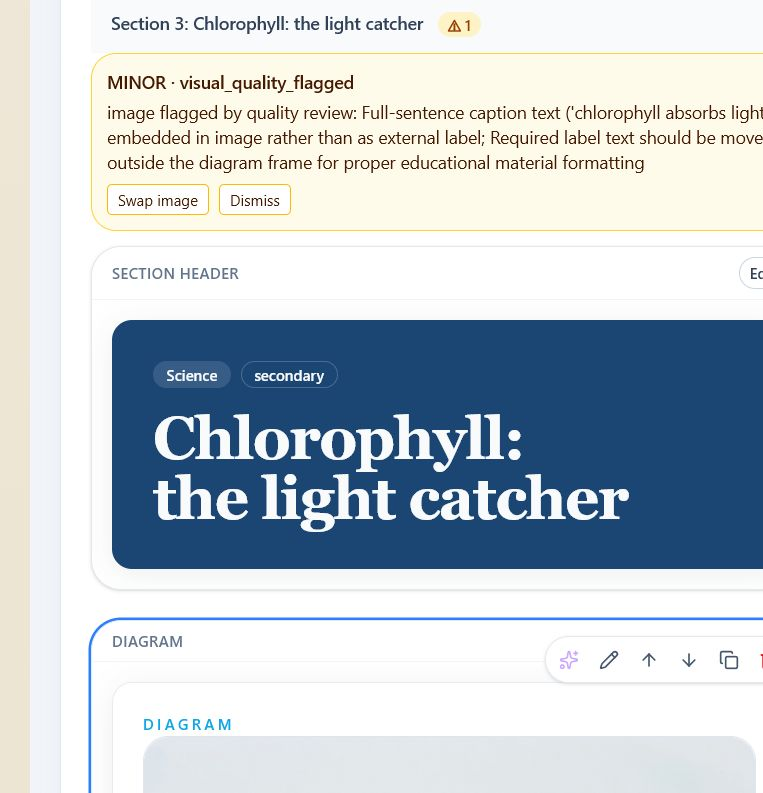
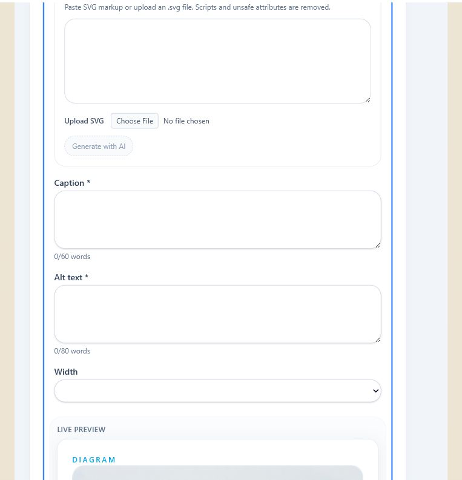

# Builder Block-Level AI Runbook

**Classification**: major

**Subsystems**: frontend Builder, frontend V3 visual refresh

## Progress

- [x] Captured the baseline and authoritative issue payloads before implementation.
- [x] Implemented deterministic question issue targeting.
- [x] Implemented targeted QC repair and advisory section review.
- [x] Implemented state-driven block AI behind the pilot feature flag.
- [x] Implemented shared single-asset visual regeneration.
- [x] Added regression fixtures and unit/component coverage.
- [x] Ran frontend, backend, architecture, and repository-wide validation.
- [x] Repeated the available signed-in production baseline flows.
- [x] Self-reviewed the final diff and recorded risks/follow-up.

## AI assistance suite baseline — 2026-07-24

Phase 0 was completed before implementation.

### Reproduction environment

- The repository frontend and backend were started on isolated local ports because
  ports 5173, 8000, and 8001 belonged to another project.
- The initial local browser session was signed out. The final pass used the
  signed-in in-app browser against the production Builder.
- The sampled production generations did not contain a `visual_mismatch` issue with
  `repair_target_id: "questions:..."`. The deterministic review fixture and the
  checked-in Builder regression fixture were used for that path, as allowed by the
  handoff.

### Captured issue payloads

Deterministic `visual_mismatch` payload:

```json
{
  "issue_id": "7f2334ab-10cf-4515-8871-bd6af86fa44a",
  "severity": "minor",
  "category": "visual_mismatch",
  "message": "Question references a visual without a planned diagram: 'Look at' at practice.practice.problems[0].question.",
  "blueprint_ref": "question_plan:practice",
  "generated_ref": "practice.practice.problems[0].question",
  "suggested_repair_executor": "question_writer",
  "repair_target_id": "questions:practice"
}
```

Live-equivalent `visual_quality_flagged` payload:

```json
{
  "issue_id": "d3b599ba-97f9-4456-a3b4-79595f2ba628",
  "severity": "minor",
  "category": "visual_quality_flagged",
  "message": "image flagged by quality review: Labels are incomplete",
  "blueprint_ref": null,
  "generated_ref": "practice",
  "suggested_repair_executor": "visual_executor",
  "repair_target_id": "visual:vis-phase0"
}
```

### Current UI behavior

- A production `visual_quality_flagged` nudge was captured in section
  “Chlorophyll: the light catcher.” The row showed `Swap image` and `Dismiss`.
  Clicking `Swap image` selected the diagram and opened manual media editing; no
  regeneration hint or AI action opened.
- The current regression fixture routes `questions:{sid}` to the first
  question-capable block. Clicking `Fix with AI` opens `AiBlockAssist` in custom
  mode with `Fix this issue in the block: <issue.message>`. This is the guessing
  behavior being replaced.
- The production nudge row and the resulting manual diagram editor were captured
  as repository evidence:





### Signed-in production replay

- Lesson ID: `ec720cd9-1aec-4cd9-aeaa-64785ed5cfa8`
- Generation ID: `ea704c14-632c-4907-8c3e-a9c7877e07b2`
- Status: “Draft rendered, but major issues remain after review/repair.”
- The `visual_quality_flagged` row still exposed only `Swap image` and `Dismiss`.
  Clicking `Swap image` opened the manual diagram media editor.
- A focused check of recent lesson
  `cfc8c342-4501-437d-ad1a-259c6910fb8a`
  (`b0022f87-b928-4709-8b5a-6710c3f0a331`) found
  `visual_quality_flagged` and `extra_unplanned_content`, but no
  `visual_mismatch`. The deterministic question fixture therefore remains the
  recorded fallback.
- Provider/model IDs are not exposed by the production Builder UI or its issue
  payload presentation, so none could be recorded without a provider-side trace.
- This replay verifies the pre-deployment baseline. The new local UI was not
  deployed as part of this repository task.

## Automated fixture

The fixed regression state is `frontend/src/lib/builder/fixtures/block-ai-regression.json`.
It contains empty and populated text blocks, a repairable practice flag, an advisory-only
flag, and a flagged diagram. Backend planning/work-order tests continue to use the fixed
`gen_5aed3804` fixtures.

## Automated evidence — 2026-07-24

- `npm run check`: passed with 0 errors and 0 warnings.
- `npm run build`: passed; only the existing Rollup annotation and chunk-size warnings were emitted.
- `npm test`: 61 test files passed, 262 tests passed.
- Builder AI targeted coverage: 25 tests passed across deterministic targeting,
  mode resolution, both feature-flag states, request shaping, QC repair,
  visual matching, shared regeneration, and failure retention. The six-test
  document-store suite also passed, including generated `image-block` URL refresh.
- Backend deterministic review: 18 tests passed.
- Backend validation: Ruff passed and 409 tests passed.
- Tooling validation: 8 tests passed.
- Architecture guard: no violations found.
- `python tools/agent/validate_repo.py --scope all`: all declared backend,
  frontend, and tooling steps passed.
- Real-provider acceptance of the new local UI was not performed because these
  commits were not deployed, so the post-implementation checklist remains
  intentionally unchecked.

## Real-provider acceptance

Prerequisites: configure the backend provider/model environment, `PUBLIC_API_URL`, image
storage, and a signed-in teacher account. Open a generated lesson in Builder so its saved
lesson has a `source_generation_id`.

- [ ] Select an empty text block and generate with FAST; content appears and one undo restores it.
- [ ] Improve a populated text block with Higher quality enabled; STANDARD is used and hidden fields remain unchanged.
- [ ] Run Custom with an edited teacher instruction; ordinary custom does not send existing content.
- [ ] Click Fix with AI on an exact question visual mismatch; the standalone-question instruction is prefilled and editable, and no existing content is sent for the custom request.
- [ ] Generate the repair; merged content appears and the issue clears only after success.
- [ ] Confirm ambiguous and section/document advisory issues show Review issue without opening AI.
- [ ] Regenerate a flagged visual with a correction; the returned URL reaches the block and the issue remains resolved after refresh.
- [ ] Select matched diagram-block and image-block cards; the regeneration toolbar action is available and prefills the QC correction hint.
- [ ] Confirm unmatched single-image cards show the next-build message and diagram-series, compare, simulation, and video blocks have no regeneration action.

Record provider/model IDs, lesson/generation IDs, and observed failures in `PROGRESS.md`.
