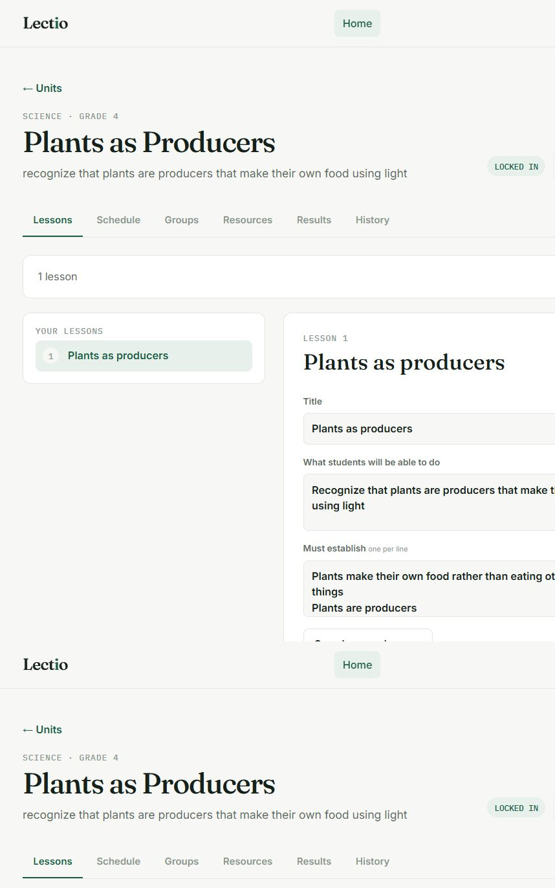
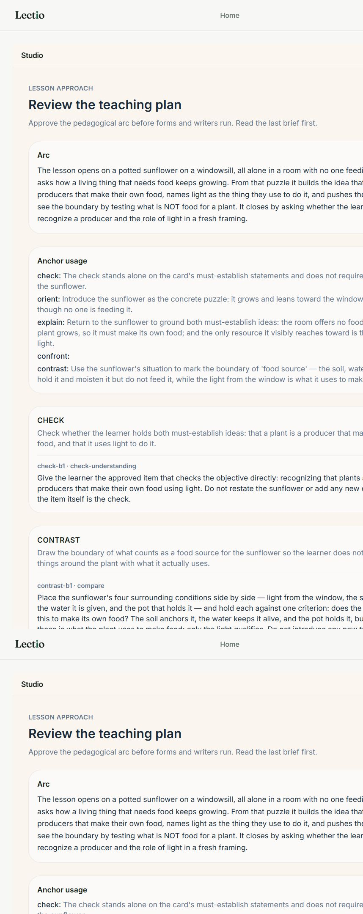
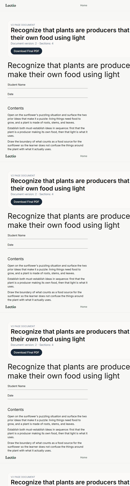

# DeepSeek strict-tool browser proof — run 01

## Run identity

- Captured: 2026-08-17T15:49:58+03:00 (Africa/Nairobi)
- Branch: `main`
- Baseline commit: `5d0e71cce92f7e3c7c0599f191f55a088a052836`
- Worktree: pre-existing dirty changes were preserved; no cleanup was performed.
- Browser flow: authenticated Google session completed in the in-app browser.
- Generation ID: `5ca9a1d7-3bb0-4d72-a5fe-cb45bc3ca6b1`
- Unit ID: `58023448-f680-4ce0-8bd0-9ee9236a9d45`

## Environment confirmation

Backend configuration loaded as:

```text
structured_mode= strict_tool
V3_FAST_PROVIDER=openai_compatible
V3_FAST_MODEL_NAME=deepseek-v4-flash
V3_FAST_BASE_URL=https://api.deepseek.com
V3_FAST_API_KEY_ENV=DEEPSEEK_API_KEY
```

The API key was set but not recorded here. Fast, standard, and premium slots routed to `api.deepseek.com`; the premium slot used `deepseek-v4-pro` during this run. The paid integration spike passed before the browser run: `1 passed, 1 deselected`.

## Lesson input

- Unit title: `Plants as Producers`
- Subject / grade: Science / Grade 4
- Lesson: `Plants as producers`
- Objective: recognize that plants are producers that make their own food using light
- Prior knowledge: plants have roots, stems, and leaves; living things need food to grow
- Exclusions: chloroplast organelles, chemical photosynthesis equations, glucose as a named sugar, and light-dependent/independent reactions

## Browser evidence







The final Studio view was a native `V2 page document`, version 2, with four rendered sections. It contained prose blocks, a rendered table, a multiple-choice check, and an answer key; it was not an empty shell.

## Studio stage timeline

1. Created the Grade 4 Science unit in the UI.
2. Path planning completed; the path was locked through the UI.
3. Selected the core lesson and clicked **Prepare Lesson**.
4. Studio opened with the native structural plan and generation ID `5ca9a1d7-3bb0-4d72-a5fe-cb45bc3ca6b1`.
5. Concept review completed and the teaching approach reached `awaiting_teaching_approval`.
6. Approved the teaching plan in Studio. The plan used a sunflower-on-a-windowsill anchor and explicitly established producer/light reasoning.
7. Native execution progressed through form planning and block writing/assembly.
8. Generation reached `ready`; the document rendered with four sections.

The teaching review displayed the advisory `LATE_BRIEF_THINNING` warning (final-quarter briefs averaged 39 words versus 79 words in the first quarter). It did not block approval or completion.

## Structured-call evidence

### Database summary

Read-only query of `llm_calls` filtered by generation ID returned **8 rows**. Every row used `api.deepseek.com` and a DeepSeek model:

| Caller | Model | Status |
| --- | --- | --- |
| `v3_item_executor` | `deepseek-v4-pro` | succeeded |
| `v2_lesson_approach_planner` (2 calls) | `deepseek-v4-pro` | succeeded |
| `v2_form_planner` | `deepseek-v4-flash` | succeeded |
| `v3_block_writer_table` | `deepseek-v4-flash` | failed, salvaged by bounded deterministic table fallback |
| `v3_block_writer_prose` (3 calls) | `deepseek-v4-pro` | succeeded |

The generation row was `status=ready` with no persisted error.

### Backend strict-event samples

These are captured from the backend process while the browser generation was running. They are representative event payloads for this generation:

```json
{"type":"llm_call_started","generation_id":"5ca9a1d7-3bb0-4d72-a5fe-cb45bc3ca6b1","caller":"v2_form_planner","node":"v2_form_planner","model_name":"deepseek-v4-flash","endpoint_host":"api.deepseek.com","structured_mode":"strict_tool","strict_fallback":false,"schema_fingerprint":"88dc34702224d14bd2c218ec434681b6bd7791187dd77e1bbfaec7163176bc650","schema_source_kind":"pydantic"}
{"type":"llm_call_failed","generation_id":"5ca9a1d7-3bb0-4d72-a5fe-cb45bc3ca6b1","caller":"v3_block_writer_table","node":"v3_block_writer_fast","model_name":"deepseek-v4-flash","endpoint_host":"api.deepseek.com","structured_mode":"strict_tool","strict_fallback":false,"schema_fingerprint":"c87eb3d52ca5dcd4515e9f358d0b652daaa10e5edef78c728b64de0e2f02d439","schema_source_kind":"pydantic","error":"Exceeded maximum output retries (0)"}
{"type":"llm_call_succeeded","generation_id":"5ca9a1d7-3bb0-4d72-a5fe-cb45bc3ca6b1","caller":"v3_block_writer_prose","node":"v3_block_writer_standard","model_name":"deepseek-v4-pro","endpoint_host":"api.deepseek.com","structured_mode":"strict_tool","strict_fallback":false,"schema_fingerprint":"03119f67f8ae972b40217611b276fbfd7cb178abb9ea99f1c49546d66ec9722f","schema_source_kind":"pydantic"}
```

The telemetry API was not used as the primary artifact because direct authenticated API navigation was blocked by the in-app browser runtime. The DB query and in-process backend event stream provide the two independent proof sources for this run.

## Validation and repair notes

The final run had one bounded writer failure: DeepSeek's table writer exhausted its configured output retries. The existing deterministic table fallback produced the rendered two-row table, so this did not become a terminal generation failure. There was no strict fallback, no `prompted_json` event, no truncation error, and no widespread schema-validation repair loop. The integration test and focused regression tests passed after the blocking compatibility fixes.

A small set of blocking compatibility fixes was required during the proof run and is present in the dirty worktree: DeepSeek-safe nullable schema projection, legacy path-anchor tolerance, provider-safe table/item schemas, and bounded table fallback. No unrelated cleanup was performed.

## Verdict

- Strict enforced: **yes**. Live structured DeepSeek events for this browser generation show `structured_mode=strict_tool`, `strict_fallback=false`, non-empty Pydantic schema fingerprints, and DeepSeek endpoint/model routing.
- Lesson completion: **yes**. The generation reached `ready` and rendered a populated native V2 document.
- Lesson quality: **acceptable for this proof**. The content was coherent, age-appropriate, respected the requested exclusions, and visibly contained sections/blocks. The advisory brief-thinning warning and the table-writer fallback should be considered for a future quality pass.
- Overall result: **PASS with bounded table-writer fallback noted**.
