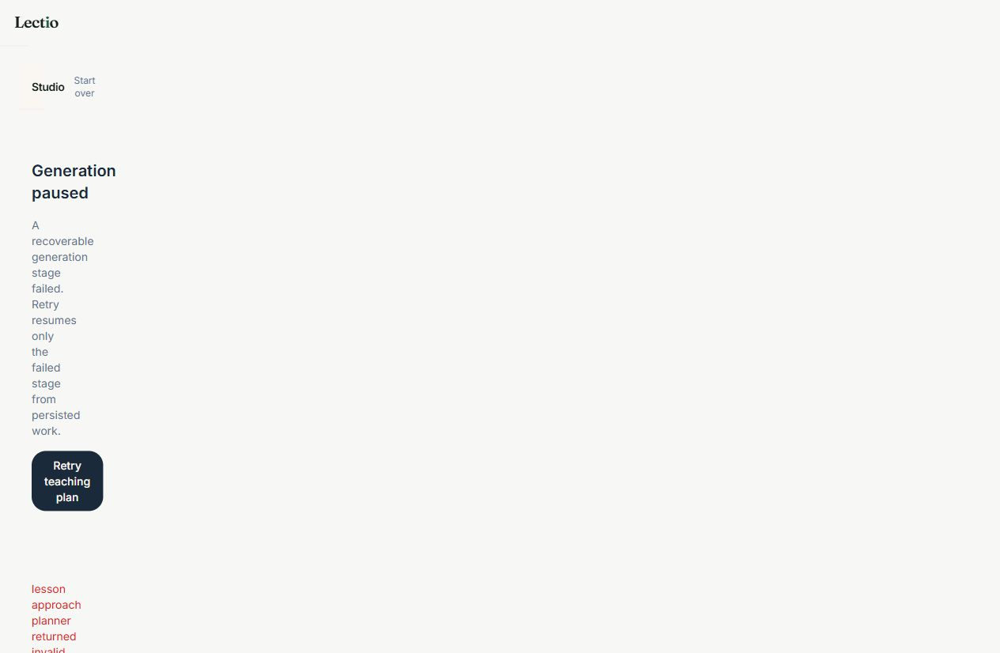
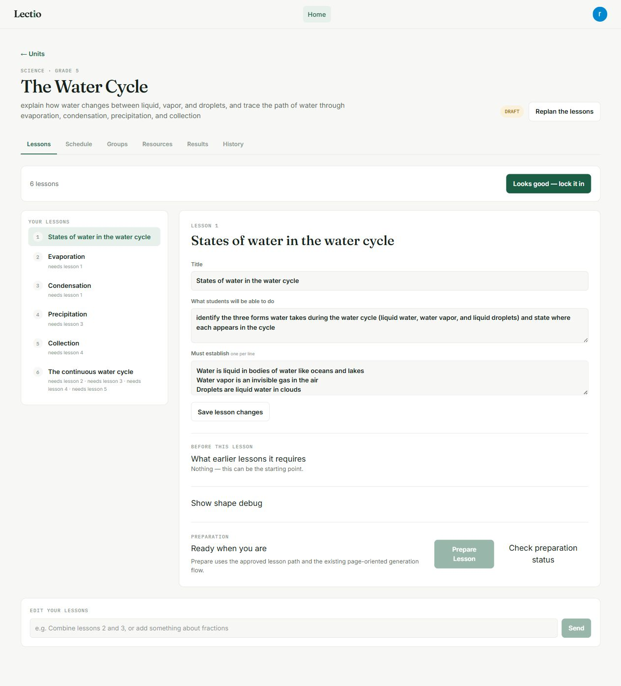
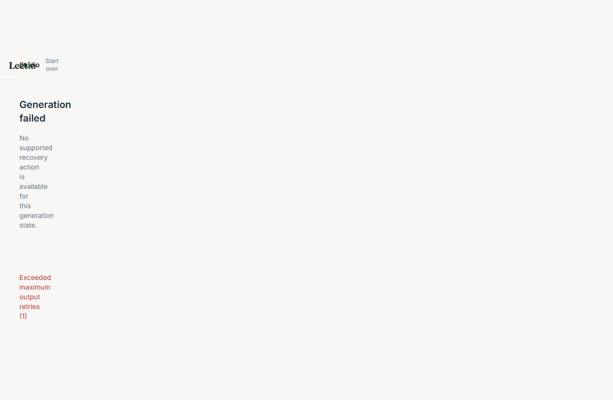

# DeepSeek strict-tool browser follow-up — two additional lesson attempts

## Run identity

- Captured: 2026-08-17T16:20:46+03:00 (Africa/Nairobi)
- Branch: `main`
- Baseline commit: `5d0e71cce92f7e3c7c0599f191f55a088a052836`
- Authentication: existing Google-authenticated in-app browser session
- Environment: `DEEPSEEK_STRUCTURED_MODE=strict_tool`
- Existing paid integration spike: passed (`1 passed, 1 deselected`)

These were additional live UI attempts after run 01. No product code was changed during these follow-up attempts.

## Results at a glance

| Attempt | Lesson | Generation ID | Result | Failure type |
| --- | --- | --- | --- | --- |
| A | Grade 5 Science — The Water Cycle | `8ff70df6-e47c-4055-bc02-5549bfce186e` | `failed_recoverable` | teaching-plan structured output had unexpected extra fields |
| B | Grade 6 Mathematics — Ratios in recipes and groups | none | stopped before generation | UI displayed `null` clarification prompt; submitting an answer returned `Internal Server Error` |
| C | Existing approved Grade 6 Mathematics — Understanding Ratios | `46ae8b41-1fa6-4879-bfa8-3d7bcdfdbdea` | `failed_terminal` | item structured output failed domain validation |

Attempt B is included because it was the second new lesson creation requested. Attempt C was then run through the existing approved ratio unit to obtain a second real native generation and test the generation pipeline independently of the malformed creation gate.

## Attempt A — Water Cycle

Input was a Grade 5 Science lesson about liquid water, water vapor, droplets, evaporation, condensation, precipitation, and collection. The unit path generated and locked in the UI. The selected lesson reached the native Studio structural plan and was sent through concept review.

Generation ID: `8ff70df6-e47c-4055-bc02-5549bfce186e`

Persisted DB result:

```text
status=failed_recoverable
error_type=TeachingPlanOutputInvalidError
error_code=MODEL_OUTPUT_INVALID
error=lesson approach planner returned invalid output after 2 attempts: anchor_usage.organise: Extra inputs are not permitted; anchor_usage.guided: Extra inputs are not permitted; anchor_usage.independent: Extra inputs are not permitted
```

The Studio recovery screen exposed **Retry teaching plan** and the exact error. Screenshot:



The unit/path screen was also captured after path planning:



The backend event logger captured strict structured traffic during this run. Representative event:

```json
{"type":"llm_call_succeeded","caller":"v3_constructor","node":"v3_constructor","model_name":"deepseek-v4-flash","endpoint_host":"api.deepseek.com","structured_mode":"strict_tool","strict_fallback":false,"schema_fingerprint":"817873761cd42717a2cca193b5540e7b18cdb52feaf569078b814420bb4cc0dc","schema_source_kind":"pydantic"}
```

The teaching-planner failure itself was also a structured-output validation failure after two attempts; the backend reported the extra `anchor_usage` fields as the precise validation cause. This is consistent with strict schema enforcement rather than a free-text/prompted-JSON path.

Read-only `llm_calls` summary for this generation returned three DeepSeek calls, all on `api.deepseek.com`: one successful `v3_item_executor` call and two failed `v2_lesson_approach_planner` attempts. The failures were recorded as `Exceeded maximum output retries (0)` while the generation-level error preserved the Pydantic field-level cause above.

## Attempt B — new ratio lesson creation

The UI accepted the subject, grade, and objective, but the readback screen rendered:

```text
One quick question
null
```

There was no generation ID. Submitting `No additional clarification is needed; proceed with the stated ratio objective.` returned an `Internal Server Error` and left the malformed clarification gate open. This is a pre-generation constructor/readback UI/server failure, not a lesson-generation failure. The backend still showed strict DeepSeek constructor calls for the readback request, including `strict_tool`, `strict_fallback=false`, and a non-empty schema fingerprint, before the readback response.

## Attempt C — Understanding Ratios

To test the native generation pipeline after Attempt B’s creation-gate failure, I opened an existing approved Grade 6 Mathematics unit in the UI and prepared its first lesson, **Introducing Ratios**.

Generation ID: `46ae8b41-1fa6-4879-bfa8-3d7bcdfdbdea`

Studio reached the native writing stage and then showed:

```text
Generation failed
No supported recovery action is available for this generation state.
Exceeded maximum output retries (1)
```

Screenshot:



Persisted DB summary:

```json
{
  "status": "failed_terminal",
  "error": "Exceeded maximum output retries (1)",
  "error_type": "UnexpectedModelBehavior",
  "error_code": "UNKNOWN",
  "calls": [
    {
      "caller": "v3_item_executor",
      "node": "v3_item_executor",
      "model": "deepseek-v4-pro",
      "endpoint_host": "api.deepseek.com",
      "status": "failed",
      "error": "[UnexpectedModelBehavior] Exceeded maximum output retries (1)"
    }
  ]
}
```

The backend traceback preserved the underlying structured validation cause: all five generated items violated the domain rule `A correct option cannot diagnose a misconception`. The provider response was therefore parsed into the typed `ItemGenerationResult` and rejected by its validator; the run did not silently accept malformed content. The DB row confirms the call was DeepSeek `deepseek-v4-pro` at `api.deepseek.com`. The backend process was running with the strict event logger and no prompted-JSON fallback was reported for this request.

## Strict-schema assessment

Strict structured output is still active. The live backend event sample for Attempt A explicitly contains:

- `structured_mode: strict_tool`
- `strict_fallback: false`
- non-empty `schema_fingerprint`
- `schema_source_kind: pydantic`
- DeepSeek model and `api.deepseek.com`

Both generation failures were typed-output validation failures rather than empty-shell success: Attempt A rejected unexpected teaching-plan fields, and Attempt C rejected semantically invalid typed item content. This confirms the schema path is enforcing output contracts, although these two additional runs did not produce ready lessons.

## Failure log / next fixes

1. **Teaching planner contract drift** — DeepSeek emitted `anchor_usage` fields for `organise`, `guided`, and `independent` that the current teaching-plan model forbids. Best next fix: align the teaching prompt/schema contract or add a narrowly scoped compatibility projection, then rerun the Water Cycle generation using the Studio retry.
2. **Constructor/readback null question** — the UI displayed a `null` clarification question and the answer submission returned `Internal Server Error`. Best next fix: treat `clarifying_question=null` as no clarification gate and proceed to readback, or fix the server route’s null-question handling.
3. **Item semantic validation** — the ratio item writer returned correct options that did not diagnose misconceptions. Best next fix: strengthen the item prompt with concrete distractor-diagnosis examples or add a bounded repair path for this specific validator error.

## Overall follow-up verdict

- Smoothness: **no** — both actual generation attempts failed, at different typed-output validation stages.
- Strict schema working: **yes, partially demonstrated** — strict mode and no-fallback fields were captured live, and typed validation rejected malformed/semantically invalid outputs.
- Lesson completion: **0/2 additional generations reached ready**.
- No additional product changes were made during these attempts.
