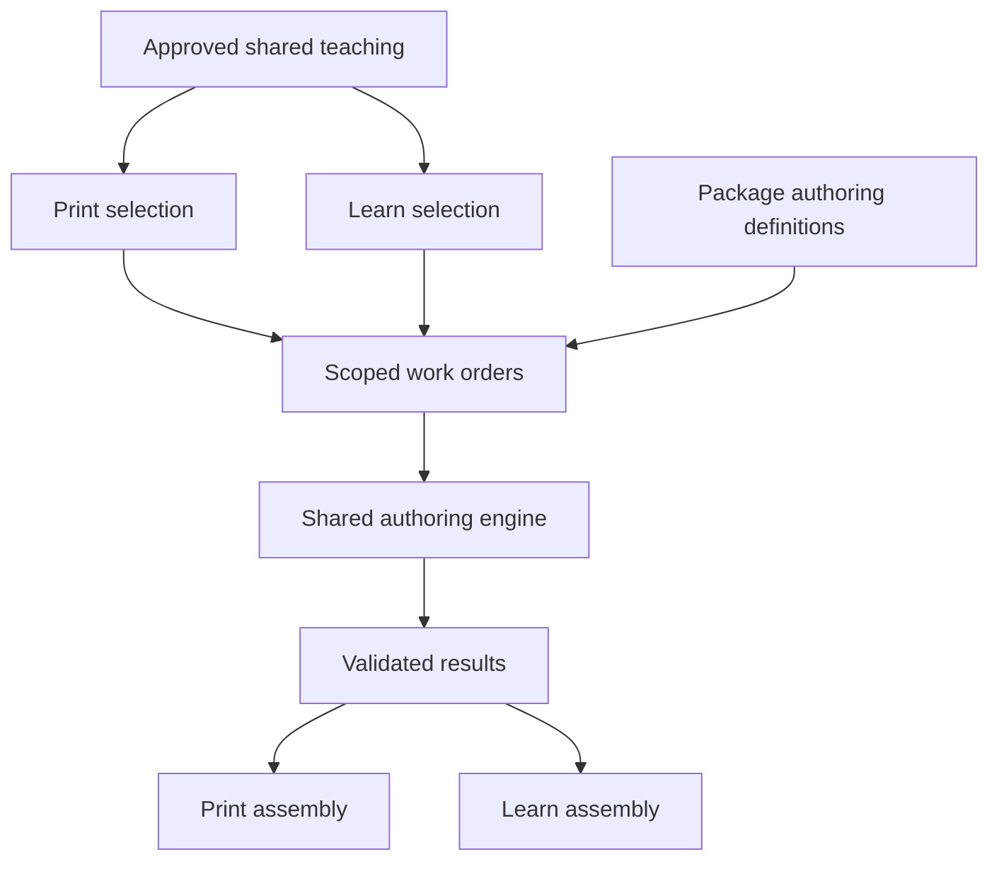

# Target architecture

The shared teaching plan defines what learning happens: objective, concepts, intent, learner action, evidence, source references and dependencies. It contains no Print form IDs or Learn component IDs. Native selection chooses presentation after approval.

## Ownership
Packages own capability meaning, selection guidance, authoring instructions, schema, constraints and named validation/processing references. Native specs own experience policy such as permitted capabilities and budgets. The application owns provider configuration, execution scheduling, checkpointing, persistence and observability. The engine loads definitions; it never invents capability semantics.

Extend the existing Print FormWriterRecord and Learn LearnWriterRecord and their generated exports. Do not add a parallel registry with duplicated semantic content. A common authoring interface can be implemented by package-specific loaders. Reuse existing provider infrastructure and Print repair behavior. Do not force document schemas, rendering or release models into one shared format.

## AuthoringDefinition contract (proposed extension)
Fields: definition_version; capability_id; native_path; lane (content/interaction); purpose; modes (generate/convert-approved); instructions (embedded or resolvable package resource); payload_schema and schema_ref; field_guidance; required_inputs; capacity; negative_cases; examples; validator_refs; optional converter_ref and postprocessor_ref.

Prompt resource references must resolve in the installed/exported package, not depend on an author's local directory. Registry construction verifies references. Validator/converter references resolve only through registered implementations; never execute arbitrary code from a model response.

Hash the complete authoring definition including instructions, schema and relevant constraints. Existing hashes that cover schemas alone do not identify the writing behavior. Pin the definition hash, prompt version, input hash and shared teaching revision in each work order/result. A prompt edit invalidates reuse for newly requested work while leaving old published releases intact. Do not overwrite old persisted schema/hash semantics without a versioned migration strategy.

## Scoped AuthoringRequest
Contains work_order_id, selected definition identity, teaching block identity, objective, relevant facts and terminology, brief, learner action/evidence, selected approved sources, resolved dependencies, applicable constraints and required output mode. No whole catalogue, sibling schemas, unrelated questions or other path's configuration. Include neighboring summaries only when needed for coherent transitions. Approved items are authoritative data, not executable instructions.

## Execution
Resolve definition -> validate required inputs -> choose permitted mode -> generate or convert -> validate schema and semantic invariants -> bounded repair if applicable -> persist validated result -> native assembly.

Conversion is deterministic only for complete compatible structured data. Preserve approved answer relationships. Do not convert free prose into exact-match answers without an established answer. New material invokes the configured provider with a common prompt plus selected capability instructions. The model must produce final material, not planning prose. Deterministic validation can establish IDs, answer membership, finite numbers, supplied relationships and policy consistency; it cannot prove general factual or pedagogical quality.

Repairs receive original scope, selected contract, previous output and structured errors. Preserve source identity and valid content. Separate transport retries from invalid-output repairs and cap both; avoid multiplying nested retry loops. Failure states include MISSING_AUTHORING_DEFINITION, MISSING_AUTHORING_INPUT, INCOMPATIBLE_APPROVED_ITEM, INVALID_PAYLOAD, NO_COMPATIBLE_CAPABILITY and REPAIR_EXHAUSTED, adapted to existing error contracts. Every failure records owning stage and retryability. Never turn failures into placeholder lessons.

Assembly is a pure consumer of complete validated results. It preserves order, repeated components, IDs, source references and runtime metadata. Missing results are errors. Asset generation and pending-asset states remain explicit separate operations. No fixed subject-specific table, generic body payload or fabricated answer can replace a failed result.

## Native selection
Eligibility is deterministic: intent/action compatibility, readiness, writer availability, assets, native policy and budgets. Multiple meaningful choices use the configured semantic selector on the closed shortlist; sole legal choices can be automatic. Both content and interactions are covered. Optional interactions follow spec policy rather than automatically appearing everywhere. Required evidence must remain satisfied. Validate model selections and repair invalid IDs; keyword overlap and catalogue order are not semantic policies.

## Migration discipline
Preserve the working Print worker, concurrency, progress events, approved-question conversion, visual lifecycle and publishing behavior. Introduce the common engine behind existing interfaces, then connect Learn to it. Tests must prove the actual entrypoints use the engine, not just that a new helper exists. Retain old releases unchanged. Audit legacy Learn component writers for reusable prompts and schemas, but do not revive the older wide SectionContent pipeline or bypass native ordered production.
