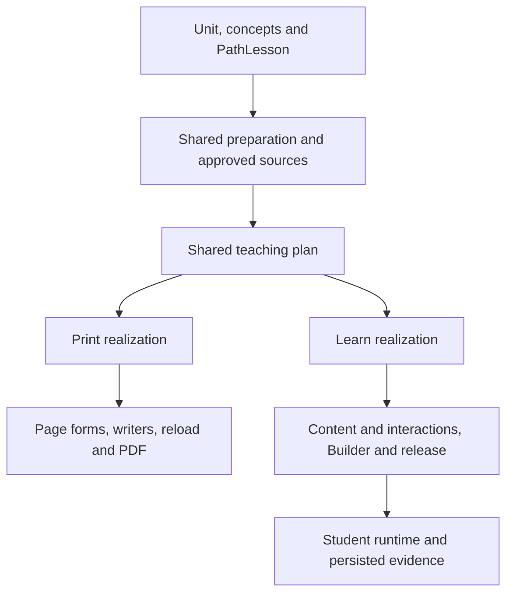

# Implementation proposal

## Product commitment
A teacher creates a Unit, approves its concept path and a lesson's instructional plan, then can produce Print, Learn, or both. Both outputs refer to the same instructional revision. Each native path preserves the objective, content scope, learner action, support level, and evidence intent, while choosing its own forms and behaviour.

The packages are authoritative for what capabilities exist and how to use them. Xplore decides which available capabilities fit a lesson. One source means one owner per definition, with generated consumer views; it does not require a giant runtime package or identical native payloads.

## Target flow

## Ownership
- Shared instructional vocabulary: a small renderer-independent export, proposed @lectio/contracts. It owns intent meanings and learner-action definitions. Reuse the existing canonical vocabulary; inventory real IDs before migration. Historical discussion of 23 intents is not permission to assume the checked-out catalogue already has exactly 23.
- @lectio/page: page objects, compatibility mappings, selection guidance, schemas, renderer constraints, print contracts.
- @lectio/learn: content and interaction definitions, supported intents/actions, data contracts, renderers, response/evaluation semantics, examples, capability readiness.
- curriculum: Unit and concept identity, objective/scope, prerequisites, skeleton semantics, shared preparation and teaching meaning. Shared teaching services must not depend on a native renderer.
- application/unit_lesson: thin orchestration, requested outputs, realization creation, cross-domain status. Native execution belongs to its domain.
- print: form selection, exact writing, visual production, native persistence and PDF.
- learn: native selection and authoring, document assembly, Builder, release, distribution, authenticated runtime and evidence.
- infra: database, provider clients, telemetry, authentication primitives.

## Design decisions
1. Instructional spec and skeleton contain no native component inventory. Native presentation policies filter package definitions separately.
2. Whole-lesson teaching planning sees instructional context to maintain coherence; native selectors see compact locked briefs and closed candidate sets; writers see one assignment.
3. Teaching plan includes intended learner actions before native writing. Activities are not appended after all content has been written.
4. Existing approved items retain identity and semantics. Richer activities use typed approved sources or controlled authoring from approved material.
5. Many-to-many intent compatibility. An instructional sequence is not automatically a Sequence interaction.
6. Native components remain different. Do not print Learn as the canonical Print route or force Print payloads into Learn.
7. Frozen revision/hash references make output reuse safe. Independent native realizations prevent one path's retries from disturbing the other.
8. Runtime assessment is derived from the immutable release. Browser evaluation may provide preview/practice feedback, but client-supplied scores are never authoritative persisted evidence.
9. Narrowing does not eliminate judgment: deterministic filtering defines legality; the LLM chooses fit among small relevant sets. Empty required sets produce typed errors.
10. No silent schema repair by dropping pedagogically meaningful fields. Code assigns technical IDs; genuinely unaccepted semantic fields trigger bounded repair or explicit diagnostics.

## Fast, controlled delivery
Work in ten gated chunks P00–P09. Start with build blockers, then capability contracts, shared semantics, native paths and delivery. Preserve working Print machinery rather than replacing it. Reuse writer execution, checkpoints, Builder and release storage where sound. Generic dispatch should come from registration, but new runtime behaviour still needs real implementation.
Do not add an LLM call per minor field. Batch whole-lesson decisions; writers may execute concurrently when they have no data dependency. Reuse persisted approved results. Measure time per stage on the live runs before claiming performance improvements.
